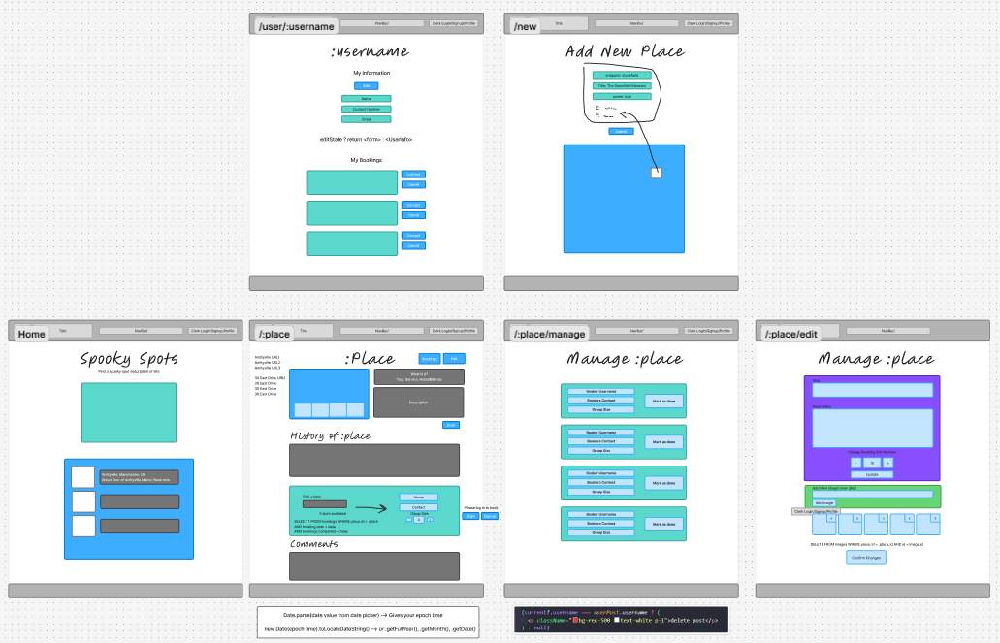
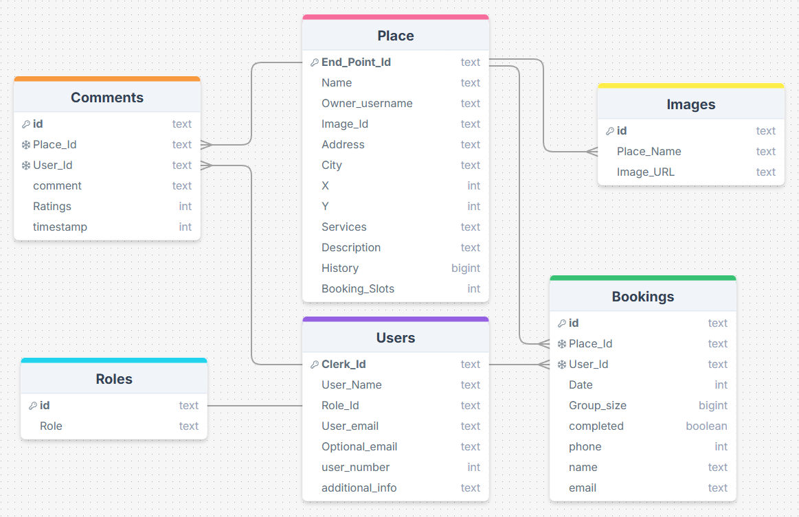
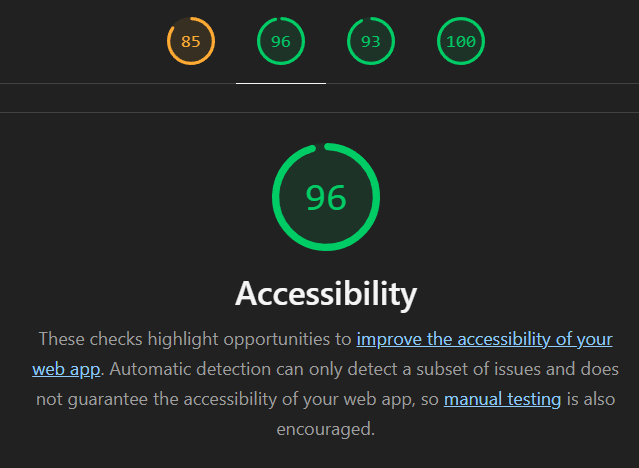

# Spooky Spots

- 🚀 Vercel link: https://spooky-spots.vercel.app
- 💻 Repo link: https://github.com/gabbythecoder/spooky-spots

- If you would like to run this app locally you can find instructions on how to do this within the folder called `/personal-docs/Setup-Guide`

## Team members

- Sam Clark
- Gabby French
- Will Sparkes

## Project description

Problem domain: Spooky Spots is all about finding 'scary experiences' for people to visit. This app bridges the gap between business owner and customer, by giving users access to a map to browse scary locations, while allowing business owners to manage bookings for their Spooky Spot.

Future Feature: Image gallery on "/place", Button to edit contact info, Booking date validation

## Requirements

#### MVP

- ✅ 🎯 Users should be able to view spooky spots and place a booking if logged in
- ✅ 🎯 Users should be able to view their existing bookings
- ✅ 🎯 Business owners should be able to view all bookings made for their spooky spot
- ✅ 🎯 Business owners should be able to change the booking slots available for any given day

#### Stretch goals

- ✅ 🏹 Users should be able to click the spooky spot from a map
- ✅ 🏹 Admin should be able to add new places for users to see
- ❌ 🏹 Image gallery on /:place
- ✅ 🏹 Custom icons on the map

We couldn't get the image gallery done due to time constraints. We decided as a group that it would be best to leave it as a future feature to add.

## Wireframe

## SQL schema

## Lighthouse report

## Reflections

[Click here to read Will's reflection](/personal-docs/Reflection/WILL-REFLECTION.md)

[Click here to read Sam's reflection](/personal-docs/Reflection/SAM-REFLECTION.md)

[Click here to read Gabby's reflection](/personal-docs/Reflection/GABBY-REFLECTION.md)

## What Went Really Well

We each discussed these points in our individual README files and have summarised them below in bullet points.

- Pair programming
- Planning
- Always agreed as a team before moving on

## Conflicts, Errors or Bugs We Encountered
These details are also included in the individual README files, and we have provided a concise summary of them below.

- Booking form 
- Place markers
- Merge conflicts

## References

#### Date

[MDN date](https://developer.mozilla.org/en-US/docs/Web/JavaScript/Reference/Global_Objects/Date) , [MDN date.now()](https://developer.mozilla.org/en-US/docs/Web/JavaScript/Reference/Global_Objects/Date/now) , [How to order](https://learnsql.com/cookbook/how-to-order-by-date-in-t-sql/#:~:text=Use%20the%20ORDER%20BY%20keyword,shown%20last%2C%20etc) , [Epoch converter](https://www.epochconverter.com/)

#### Map

[Leaflet](https://leafletjs.com/) , [Leaflet start guide](https://leafletjs.com/examples/quick-start/) , [maptiler](https://docs.maptiler.com/) , [Tile providers](https://wiki.openstreetmap.org/wiki/Raster_tile_providers) , [React leaflet](https://react-leaflet.js.org/) , [Markers With Custom Icons](https://leafletjs.com/examples/custom-icons/)
